    1. Собствени стойности и собствени вектори
    Матрица A:
    [[ 2 -4]
     [-1 -1]]
    Собствени стойности: [ 3. -2.]
    Собствени вектори:
    [[ 0.9701425   0.70710678]
     [-0.24253563  0.70710678]]
    
    Проверка за собствен вектор 1:
    A*v1 = [ 2.9104275  -0.72760688]
    λ1*v1 = [ 2.9104275  -0.72760688]
    Разлика: 0.0000000000
    
    Проверка за собствен вектор 2:
    A*v2 = [-1.41421356 -1.41421356]
    λ2*v2 = [-1.41421356 -1.41421356]
    Разлика: 0.0000000000
    
    2. Собствен базис и спектър на матрица
    Спектър на матрицата A: [ 3. -2.]
    Собствен базис на матрицата A:
    [[ 0.9701425   0.70710678]
     [-0.24253563  0.70710678]]
    Детерминанта на матрицата от собствени вектори: 0.8574929257125441
    Собствените вектори са линейно независими, когато детерминантата е различна от 0.
    
    3. Собствени стойности и вектори
    Изчисляване на характеристичното уравнение на матрица
    Характеристично уравнение det(A - λI) = 0:
    det([ [2-λ, -4], [-1, -1-λ] ]) = 0
    (2-λ)(-1-λ) - (-4)(-1) = 0
    (2-λ)(-1-λ) - 4 = 0
    λ² - λ + 2λ + 4 = 0
    λ² + λ + 4 = 0
    Дискриминанта: -15
    Комплексни корени: [(-0.5+1.9364916731037085j), (-0.5-1.9364916731037085j)]
    Сравнение с numpy: [ 3. -2.]
    
    4. Визуализация на проекция
    


    
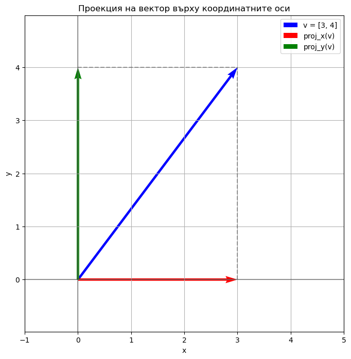
    


    
    5. Как проекцията запазва форми
    


    
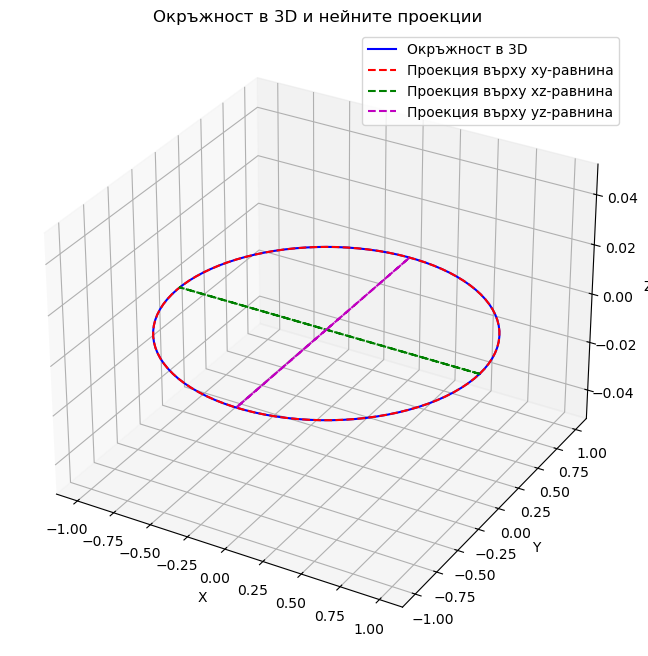
    


    
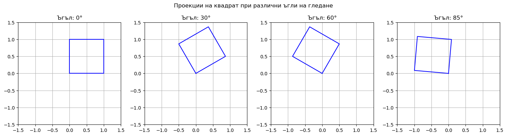
    


    
    6. Връзка между проекцията и собствените стойности/вектори
    Ковариационна матрица на данните:
    [[2.77887321 1.86860019]
     [1.86860019 1.91832035]]
    Собствени стойности на ковариационната матрица: [4.26609631 0.43109725]
    Собствени вектори на ковариационната матрица:
    [[-0.78243036  0.62273809]
     [-0.62273809 -0.78243036]]
    


    
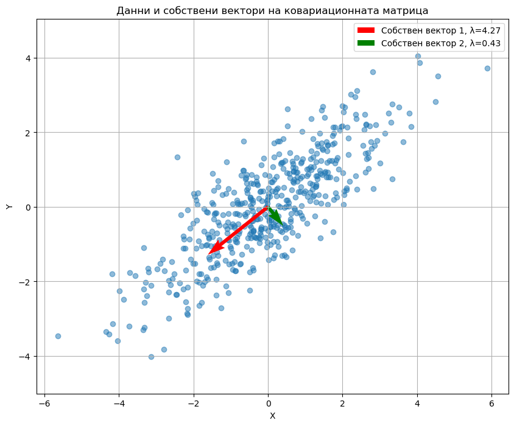
    


    
    7. PCA - имплементация от нулата
    Форма на оригиналните данни: (100, 3)
    Форма на редуцираните данни: (100, 2)
    Форма на компонентите: (3, 2)
    Обяснена вариация: [9.85167533 8.78219872]
    Процент обяснена вариация: [38.12467916 33.98594626]
    Общо обяснена вариация: 72.11%
    
    8. Главните компоненти
    Брой оригинални характеристики в данните: 3
    Максимален брой главни компоненти: 3
    Избран брой главни компоненти: 2
    


    
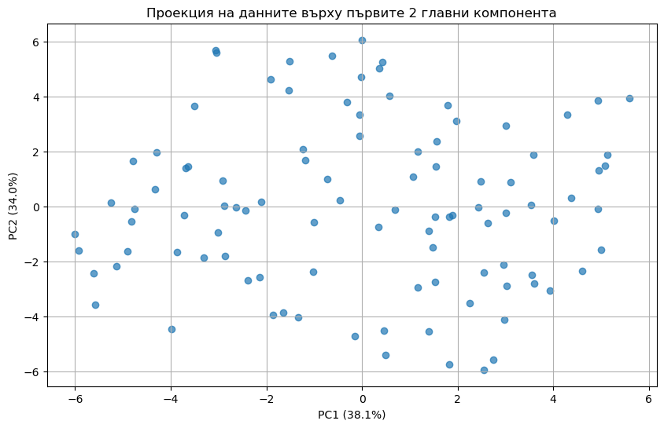
    


    
    9. Дисперсия и обяснена дисперсия
    Дисперсия по оригиналните характеристики: [8.09537493 9.52734503 8.21795739]
    Обща дисперсия: 25.84067734954618
    Дисперсия по главните компоненти: [9.75315858 8.69437673]
    Обща дисперсия след PCA: 18.447535309123623
    
    10. Връзка между главните компоненти и обяснената дисперсия
    


    
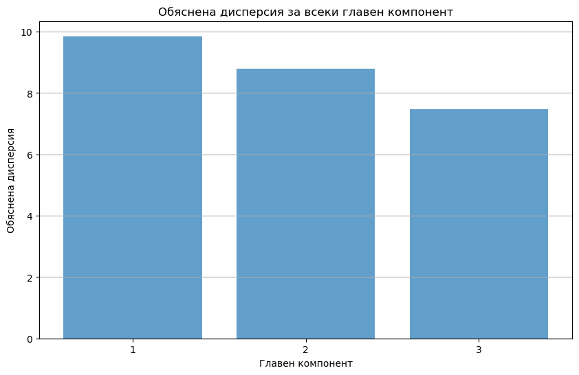
    


    
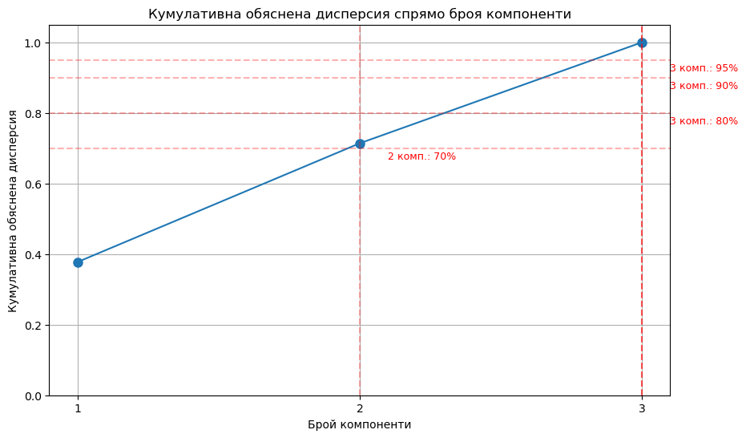
    


    
    11. Демонстрация на PCA върху реални данни - Iris dataset
    Форма на Iris dataset: (150, 4)
    Характеристики: ['sepal length (cm)', 'sepal width (cm)', 'petal length (cm)', 'petal width (cm)']
    Класове: ['setosa' 'versicolor' 'virginica']
    Обяснена дисперсия за всеки компонент: [2.93808505 0.9201649 ]
    Процент обяснена дисперсия: [73.45212625 23.0041226 ]
    Общо обяснена дисперсия: 96.46%
    


    
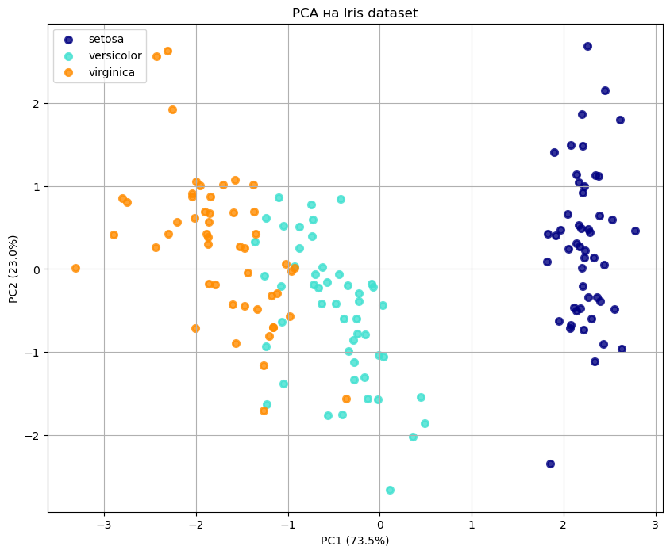
    


    
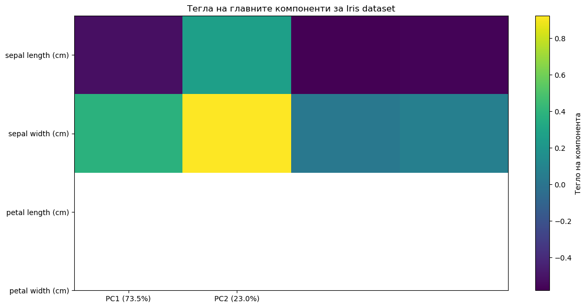
    


    
    12. PCA: редуциране на 3D данни до 2D
    Обяснена дисперсия за всеки компонент: [89.94438486 37.63085922]
    Процент обяснена дисперсия: [67.6806429  28.31617281]
    Общо обяснена дисперсия: 96.00%
    


    
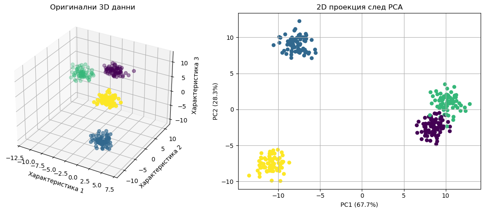
    


    
    13. Практическо приложение: визуализация на данни с висока размерност
    Форма на генерираните 15D данни: (500, 15)
    Обяснена дисперсия за всеки компонент: [145.74683547 122.99739844  88.98880901]
    Процент обяснена дисперсия: [27.26420114 23.00856687 16.64673391]
    Общо обяснена дисперсия: 66.92%
    


    
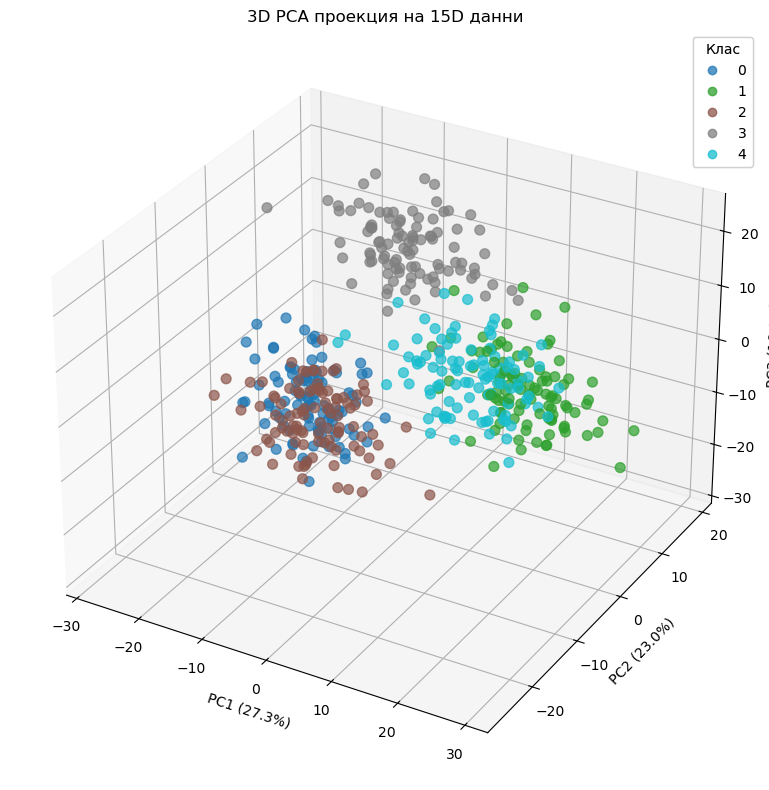
    


    
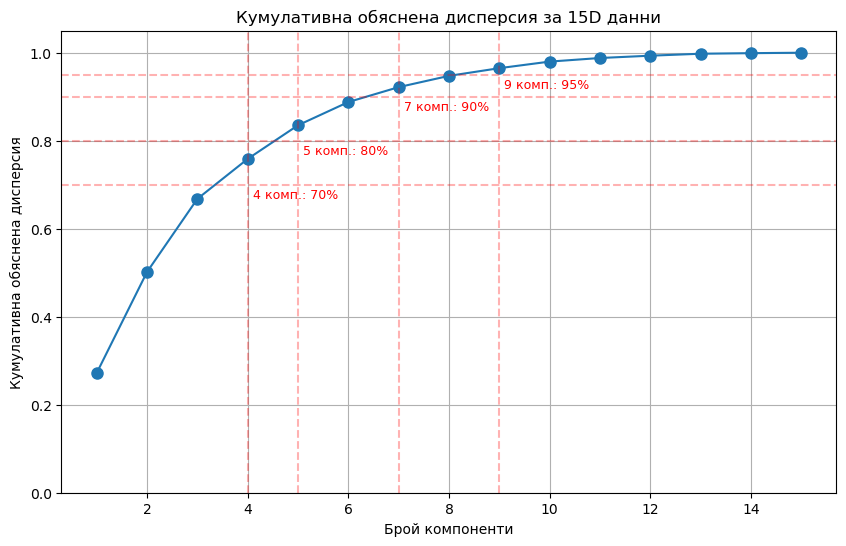
    


    
    
    
    
    
    
    
    
    
    
    
    
    
    
    


```python

```
